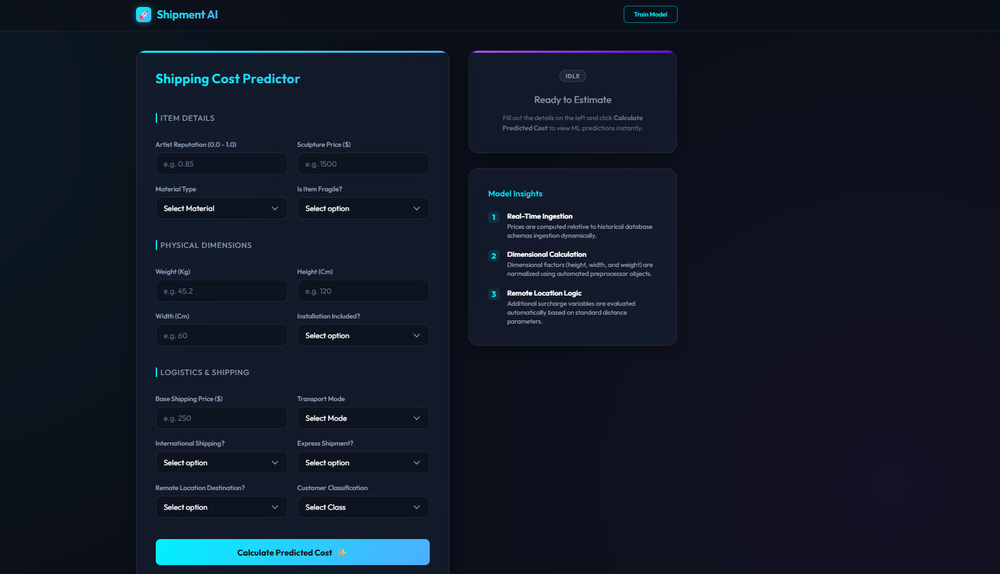

# 🚀 Shipment Price Predictor - AI Dashboard

An advanced machine learning solution designed to predict shipment costs with high accuracy based on item dimensions, weight, materials, transport mode, and destination coordinates. This project optimizes logistics operations, reduces shipping overheads, and automates pricing strategies for supply chains.



---

## 🛠️ Features & Stack

### **Key Features**
- **Machine Learning Pipeline**: Complete pipeline featuring data ingestion, schema validation, data drift detection (using Evidently), custom preprocessors, model training, evaluation, and deployment.
- **Glassmorphic AI Dashboard**: A premium, high-tech dark theme UI containing interactive forms, real-time validations, and clean Outfit typography.
- **Robust Model Fallback**: Falls back automatically to loading local model pickles (`artifacts/`) if AWS S3 integration is offline or credentials are missing/invalid.
- **Dynamic Training Trigger**: Initiate model training dynamically from the dashboard with visual progress indicators, loading overlays, and success/error Toast notifications.

### **Tech Stack**
- **Frontend**: Vanilla HTML5, Custom CSS3 (Glassmorphism), JavaScript (Fetch API / AJAX)
- **Backend Framework**: FastAPI (Uvicorn ASGI server)
- **Machine Learning**: Python 3.8, Scikit-learn, Pandas, NumPy, Dill
- **Data & Storage**: MongoDB Atlas (NoSQL database), AWS S3 Bucket storage

---

## 💻 Installation & Setup

Follow these step-by-step instructions to download, set up, and run the Shipment Price Predictor locally:

### **1. Prerequisites**
Ensure you have the following installed:
- Python 3.8 (or Miniconda/Anaconda)
- Git

### **2. Clone the Repository**
```bash
git clone https://github.com/pratiksutar841/Shipment-Price-Prediction.git
cd Shipment-Price-Prediction
```

### **3. Set Up Virtual Environment**
Create and activate a virtual environment using either **Conda** or **Python venv**:

**Option A: Using Conda (Recommended)**
```bash
conda create --prefix venv python=3.8 -y
conda activate venv/
```

**Option B: Using Python Virtual Environment**
```bash
python -m venv venv
# On Windows (cmd/PowerShell):
.\venv\Scripts\activate
# On Linux/macOS:
source venv/bin/activate
```

### **4. Install Dependencies**
```bash
pip install -r requirements.txt
```

### **5. Configure Environment Variables**
Create a file named `.env` in the root directory of the project and add your database and cloud configurations:

```env
MONGO_DB_URL="mongodb+srv://<username>:<password>@<cluster>.mongodb.net/?retryWrites=true&w=majority"
AWS_ACCESS_KEY_ID="your_aws_access_key"
AWS_SECRET_ACCESS_KEY="your_aws_secret_key"
AWS_REGION="us-west-2"
```

> [!NOTE]  
> If you do not have AWS configured or if your keys are invalid, the predictor will automatically fall back to using the local model file located in the `artifacts/` folder, enabling fully offline evaluation.

---

## 🚀 Running the Project

### **1. Launching the Web Server**
Start the FastAPI server by running:
```bash
python app.py
```
*Note: Make sure your active virtual environment is running.*

### **2. Accessing the Dashboard**
Open your browser and navigate to:
```
http://localhost:8080/predict
```

### **3. Running Model Training**
To ingest raw MongoDB data and retrain the model, you can:
- Click the **Train Model** button on the top-right header of the web page.
- Or access the training endpoint directly: `http://localhost:8080/train`.

---

## 📊 Application Output

- **Predictor Form**: Enter shipment criteria (reputation, sculpture price, material, weight, dimensions, base price, express, fragile, transport mode, etc.).
- **Live Output**: Click **Calculate Predicted Cost** to view the estimated shipping cost instantly on the glowing right-hand results panel.